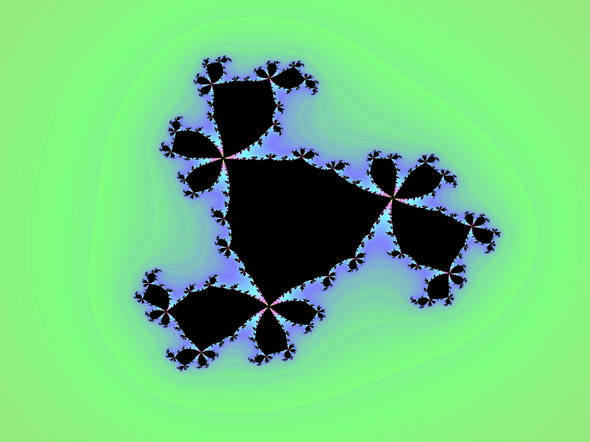

Initially based on the [Vulkano book](https://vulkano.rs/).

As soon as I discovered how to render images, I decided not only to render standard mandelbrote set like in the book, but I also decided to make it more colourful.
I referenced this [blog post](https://arnestenkrona.github.io/blog/2021/03/04/Mandelbrot-in-Shadertoy) when making a compute shader.

I also made a shader for displaying Julia set.

And Julia set 3rd degree.

